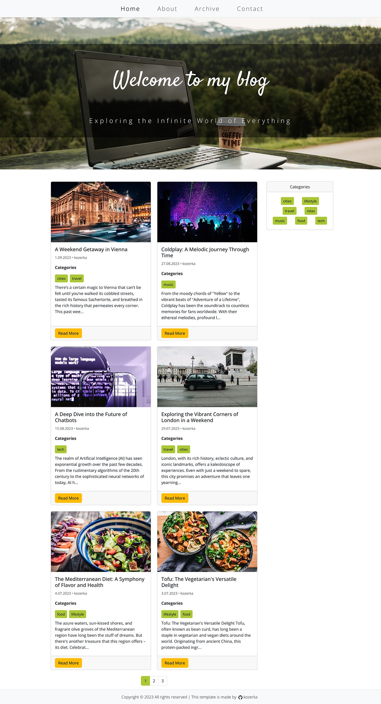

## Blog Powered by Prismic and React-Bootstrap

### Introduction

This blog is developed using the power of headless CMS, specifically with [Prismic](https://prismic.io/docs/technologies/introduction-to-the-content-query-api) in mind. It leverages the flexibility offered by headless CMSs to create, manage, and deliver content without the need for a dedicated backend system. This makes it an excellent choice for frontend developers who wish to focus on the frontend without getting entangled with backend intricacies.

<p align="center">
  
</p>

## Technology Stack

       

### Key Features

1. **Headless CMS**: This blog harnesses a [headless CMS](https://www.unity.pl/blog/co-warto-wiedziec-o-headless-cms/) which allows for content creation without a dedicated backend. The user-friendly UI allows easy field creation to structure the site's content.

2. **Content Management with Prismic**: All the content of this blog, from posts to images, is fetched via Prismic's API. Prismic offers an intuitive content management experience and its documentation provides invaluable resources for technologies like [JavaScript](https://prismic.io/docs/technologies/integrating-with-an-existing-project-javascript) and [React](https://prismic.io/docs/technologies/start-a-prismic-project-from-scratch-with-reactjs). Test queries can also be made using Prismic's [REST API browser tool](https://prismic.io/docs/technologies/the-rest-api-browser).

3. **Routing with React-Router-Dom v6**: Efficient and intuitive page routing is achieved using the react-router-dom v6.

4. **Pagination**: Content visibility is optimized using pagination, ensuring a maximum of 6 posts are visible per page.

5. **Diverse Sections**:
   - **HomePage**: The landing page of the blog.
   - **About**: Provides details about the blog or author.
   - **Categories**: Dynamically managed via Prismic, allowing easy addition or removal.
   - **Contact**: Equipped with a contact form to allow readers or visitors to get in touch.
   - **Archive Page**: Offers advanced post-filtering capabilities. Users can filter posts based on date ranges, or by specific months and years.

6. **Responsive Design**: The site is fully responsive, ensuring an optimal viewing experience across all device resolutions and screen sizes.


## Getting Started

1. **Clone the repository**:
   ```bash
   git clone [Repo-URL]
   ```

2. **Navigate to the project directory**:
   ```bash
   cd [Repo-Name]
   ```

3. **Install dependencies**:
   ```bash
   npm install
   ```

4. **Run the application**:
   ```bash
   npm start
   ```


### Conclusion

This blog is a seamless integration of Prismic's headless CMS with React. With the added styling prowess of React-Bootstrap, it offers a user-friendly, visually appealing, and efficiently managed blogging platform.


---

## License

[MIT](https://choosealicense.com/licenses/mit/)

---

Created with ❤️ by [kozerka].

---

&nbsp;

## 🙏 Special Thanks

A heartfelt thank you to my [Mentor - devmentor.pl](https://devmentor.pl/) for setting forth this challenge.

---
